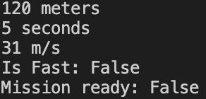

# 4 - Vehicle Speed Calculator
Calculates vehicle speed and uses operators to check if the ride is fast and mission is ready.

**Key Concepts**
- Operators (Arithmetic, Assignment, Comparison, Logical)
- Math

