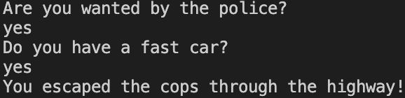

# 07 - Police Chase Logic
Simulates a police chase with four possible outcomes based on player choices.

**Key Concepts:**
- Boolean logic (yes/no)
- If...Else Statements (if, else, else if)
- User Input (Console.ReadLine())

